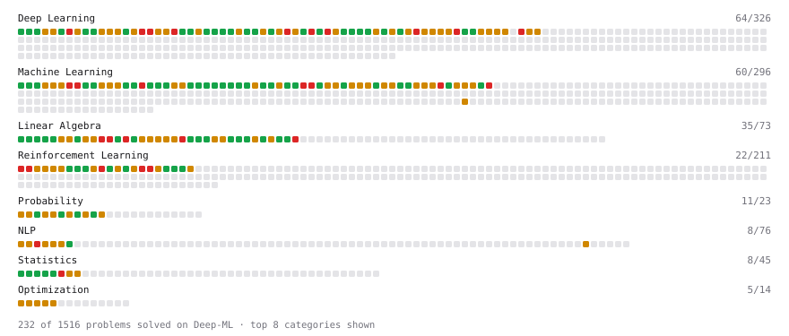

# Deep-ML

My machine learning practice from [Deep-ML](https://www.deep-ml.com). Every solution here was written by hand.

**Completed:** Calculus (9/9)

**372** solved · 372 problems · 0 labs · 0 math

[**Browse the interactive portfolio**](https://aradfarahani.github.io/deep-ml/) to replay this filling in over time.

## Problems

| | Difficulty | Solved | |
| --- | --- | --- | --- |
| [Adagrad Optimizer](https://www.deep-ml.com/problems/145) | easy | 2025-06-26 | [solution](problems/0145-adagrad-optimizer) |
| [Adamax Optimizer](https://www.deep-ml.com/problems/148) | easy | 2025-06-26 | [solution](problems/0148-adamax-optimizer) |
| [Apply Zero Padding to an Image](https://www.deep-ml.com/problems/239) | easy | 2026-10-02 | [solution](problems/0239-apply-zero-padding-to-an-image) |
| [Batch Iterator for Dataset](https://www.deep-ml.com/problems/30) | easy | 2025-04-07 | [solution](problems/0030-batch-iterator-for-dataset) |
| [Bhattacharyya Distance Between Two Distributions](https://www.deep-ml.com/problems/120) | easy | 2025-04-07 | [solution](problems/0120-bhattacharyya-distance-between-two-distributions) |
| [Binary Classification with Logistic Regression](https://www.deep-ml.com/problems/104) | easy | 2025-04-07 | [solution](problems/0104-binary-classification-with-logistic-regression) |
| [Calculate 2x2 Matrix Inverse](https://www.deep-ml.com/problems/8) | easy | 2025-04-06 | [solution](problems/0008-calculate-2x2-matrix-inverse) |
| [Calculate Accuracy Score](https://www.deep-ml.com/problems/36) | easy | 2025-04-07 | [solution](problems/0036-calculate-accuracy-score) |
| [Calculate Batch Prediction Health Metrics](https://www.deep-ml.com/problems/249) | easy | 2026-10-02 | [solution](problems/0249-calculate-batch-prediction-health-metrics) |
| [Calculate Computational Efficiency of MoE](https://www.deep-ml.com/problems/123) | easy | 2025-04-22 | [solution](problems/0123-calculate-computational-efficiency-of-moe) |
| [Calculate Conditional Probability from Data](https://www.deep-ml.com/problems/168) | easy | 2025-07-21 | [solution](problems/0168-calculate-conditional-probability-from-data) |
| [Calculate Cosine Similarity Between Vectors](https://www.deep-ml.com/problems/76) | easy | 2025-04-07 | [solution](problems/0076-calculate-cosine-similarity-between-vectors) |
| [Calculate Covariance Matrix](https://www.deep-ml.com/problems/10) | easy | 2025-04-07 | [solution](problems/0010-calculate-covariance-matrix) |
| [Calculate Dice Score for Classification](https://www.deep-ml.com/problems/73) | easy | 2025-04-07 | [solution](problems/0073-calculate-dice-score-for-classification) |
| [Calculate F1 Score from Predicted and True Labels](https://www.deep-ml.com/problems/91) | easy | 2025-04-07 | [solution](problems/0091-calculate-f1-score-from-predicted-and-true-labels) |
| [Calculate Image Brightness](https://www.deep-ml.com/problems/70) | easy | 2025-04-07 | [solution](problems/0070-calculate-image-brightness) |
| [Calculate Jaccard Index for Binary Classification](https://www.deep-ml.com/problems/72) | easy | 2025-04-07 | [solution](problems/0072-calculate-jaccard-index-for-binary-classification) |
| [Calculate Mean Absolute Error (MAE)](https://www.deep-ml.com/problems/93) | easy | 2025-04-07 | [solution](problems/0093-calculate-mean-absolute-error-mae) |
| [Calculate Mean by Row or Column](https://www.deep-ml.com/problems/4) | easy | 2025-04-06 | [solution](problems/0004-calculate-mean-by-row-or-column) |
| [Calculate Model Inference Statistics for Monitoring](https://www.deep-ml.com/problems/248) | easy | 2026-10-02 | [solution](problems/0248-calculate-model-inference-statistics-for-monitoring) |
| [Calculate Number of Parameters in Neural Network](https://www.deep-ml.com/problems/371) | easy | 2026-10-04 | [solution](problems/0371-calculate-number-of-parameters-in-neural-network) |
| [Calculate P50/P95/P99 Latency Percentiles](https://www.deep-ml.com/problems/293) | easy | 2026-10-04 | [solution](problems/0293-calculate-p50-p95-p99-latency-percentiles) |
| [Calculate Perplexity for Language Models](https://www.deep-ml.com/problems/320) | easy | 2026-10-04 | [solution](problems/0320-calculate-perplexity-for-language-models) |
| [Calculate Portfolio Variance](https://www.deep-ml.com/problems/183) | easy | 2025-09-14 | [solution](problems/0183-calculate-portfolio-variance) |
| [Calculate R-squared for Regression Analysis](https://www.deep-ml.com/problems/69) | easy | 2025-04-07 | [solution](problems/0069-calculate-r-squared-for-regression-analysis) |
| [Calculate Root Mean Square Error (RMSE)](https://www.deep-ml.com/problems/71) | easy | 2025-04-07 | [solution](problems/0071-calculate-root-mean-square-error-rmse) |
| [Calculate SLA Compliance Metrics for Model Service](https://www.deep-ml.com/problems/250) | easy | 2026-10-04 | [solution](problems/0250-calculate-sla-compliance-metrics-for-model-service) |
| [Calculate SVM Margin Width](https://www.deep-ml.com/problems/282) | easy | 2026-10-04 | [solution](problems/0282-calculate-svm-margin-width) |
| [Calculate the Discounted Return for a Given Trajectory](https://www.deep-ml.com/problems/167) | easy | 2025-07-21 | [solution](problems/0167-calculate-the-discounted-return-for-a-given-trajectory) |
| [Calculate the Phi Coefficient](https://www.deep-ml.com/problems/95) | easy | 2025-04-07 | [solution](problems/0095-calculate-the-phi-coefficient) |
| [Calculate Unigram Probability from Corpus](https://www.deep-ml.com/problems/129) | easy | 2025-05-18 | [solution](problems/0129-calculate-unigram-probability-from-corpus) |
| [Character-Level Tokenizer (stoi/itos/BOS)](https://www.deep-ml.com/problems/374) | easy | 2026-10-04 | [solution](problems/0374-character-level-tokenizer-stoi-itos-bos) |
| [Check Linear Independence of Vectors](https://www.deep-ml.com/problems/331) | easy | 2026-10-04 | [solution](problems/0331-check-linear-independence-of-vectors) |
| [Compute Discounted Return](https://www.deep-ml.com/problems/165) | easy | 2025-07-21 | [solution](problems/0165-compute-discounted-return) |
| [Compute Multi-class Cross-Entropy Loss](https://www.deep-ml.com/problems/134) | easy | 2025-05-25 | [solution](problems/0134-compute-multi-class-cross-entropy-loss) |
| [Compute Posterior Probability using Bayes' Theorem](https://www.deep-ml.com/problems/336) | easy | 2026-10-04 | [solution](problems/0336-compute-posterior-probability-using-bayes-theorem) |
| [Compute Temporal Difference Error](https://www.deep-ml.com/problems/257) | easy | 2026-10-04 | [solution](problems/0257-compute-temporal-difference-error) |
| [Compute the Cross Product of Two 3D Vectors](https://www.deep-ml.com/problems/118) | easy | 2025-04-07 | [solution](problems/0118-compute-the-cross-product-of-two-3d-vectors) |
| [Convert RGB Image to Grayscale](https://www.deep-ml.com/problems/237) | easy | 2026-10-02 | [solution](problems/0237-convert-rgb-image-to-grayscale) |
| [Convert Vector to Diagonal Matrix](https://www.deep-ml.com/problems/35) | easy | 2025-04-07 | [solution](problems/0035-convert-vector-to-diagonal-matrix) |
| [Demonstrate Law of Large Numbers with Sampling](https://www.deep-ml.com/problems/342) | easy | 2026-10-04 | [solution](problems/0342-demonstrate-law-of-large-numbers-with-sampling) |
| [Derivative of a Polynomial](https://www.deep-ml.com/problems/116) | easy | 2025-04-07 | [solution](problems/0116-derivative-of-a-polynomial) |
| [Derivatives of Activation Functions](https://www.deep-ml.com/problems/217) | easy | 2026-10-02 | [solution](problems/0217-derivatives-of-activation-functions) |
| [Descriptive Statistics Calculator](https://www.deep-ml.com/problems/78) | easy | 2025-04-07 | [solution](problems/0078-descriptive-statistics-calculator) |
| [Detect Overfitting or Underfitting](https://www.deep-ml.com/problems/86) | easy | 2025-04-07 | [solution](problems/0086-detect-overfitting-or-underfitting) |
| [Dot Product Calculator](https://www.deep-ml.com/problems/83) | easy | 2025-04-07 | [solution](problems/0083-dot-product-calculator) |
| [Dynamic Tanh: Normalization-Free Transformer Activation](https://www.deep-ml.com/problems/128) | easy | 2025-05-07 | [solution](problems/0128-dynamic-tanh-normalization-free-transformer-activation) |
| [Early Stopping Based on Validation Loss Plateau](https://www.deep-ml.com/problems/199) | easy | 2026-10-01 | [solution](problems/0199-early-stopping-based-on-validation-loss-plateau) |
| [Empirical Probability Mass Function (PMF)](https://www.deep-ml.com/problems/184) | easy | 2026-10-01 | [solution](problems/0184-empirical-probability-mass-function-pmf) |
| [Exact Match Score with Normalization](https://www.deep-ml.com/problems/325) | easy | 2026-10-04 | [solution](problems/0325-exact-match-score-with-normalization) |
| [Expected Value and Variance of an n-Sided Die](https://www.deep-ml.com/problems/179) | easy | 2025-09-14 | [solution](problems/0179-expected-value-and-variance-of-an-n-sided-die) |
| [Exponential Distribution PDF and CDF](https://www.deep-ml.com/problems/340) | easy | 2026-10-04 | [solution](problems/0340-exponential-distribution-pdf-and-cdf) |
| [Exponential Weighted Average of Rewards](https://www.deep-ml.com/problems/161) | easy | 2025-07-21 | [solution](problems/0161-exponential-weighted-average-of-rewards) |
| [ExponentialLR Learning Rate Scheduler](https://www.deep-ml.com/problems/154) | easy | 2025-07-21 | [solution](problems/0154-exponentiallr-learning-rate-scheduler) |
| [Feature Scaling Implementation](https://www.deep-ml.com/problems/16) | easy | 2025-04-07 | [solution](problems/0016-feature-scaling-implementation) |
| [Flip an Image Horizontally or Vertically](https://www.deep-ml.com/problems/238) | easy | 2026-10-02 | [solution](problems/0238-flip-an-image-horizontally-or-vertically) |
| [GeLU Activation Function ](https://www.deep-ml.com/problems/147) | easy | 2025-06-26 | [solution](problems/0147-gelu-activation-function) |
| [Generate a Confusion Matrix for Binary Classification](https://www.deep-ml.com/problems/75) | easy | 2025-04-07 | [solution](problems/0075-generate-a-confusion-matrix-for-binary-classification) |
| [Gradient Checkpointing](https://www.deep-ml.com/problems/188) | easy | 2026-10-01 | [solution](problems/0188-gradient-checkpointing) |
| [Gradient Direction and Magnitude](https://www.deep-ml.com/problems/308) | easy | 2026-10-04 | [solution](problems/0308-gradient-direction-and-magnitude) |
| [Grayscale Image Contrast Calculator](https://www.deep-ml.com/problems/82) | easy | 2025-04-07 | [solution](problems/0082-grayscale-image-contrast-calculator) |
| [Group Relative Advantage for GRPO](https://www.deep-ml.com/problems/224) | easy | 2026-10-02 | [solution](problems/0224-group-relative-advantage-for-grpo) |
| [Implement 2D Average Pooling](https://www.deep-ml.com/problems/265) | easy | 2026-10-04 | [solution](problems/0265-implement-2d-average-pooling) |
| [Implement a Simple Residual Block with Shortcut Connection](https://www.deep-ml.com/problems/113) | easy | 2025-04-07 | [solution](problems/0113-implement-a-simple-residual-block-with-shortcut-connection) |
| [Implement Binary Cross-Entropy Loss](https://www.deep-ml.com/problems/263) | easy | 2026-10-04 | [solution](problems/0263-implement-binary-cross-entropy-loss) |
| [Implement Compressed Column Sparse Matrix Format (CSC)](https://www.deep-ml.com/problems/67) | easy | 2025-04-07 | [solution](problems/0067-implement-compressed-column-sparse-matrix-format-csc) |
| [Implement Compressed Row Sparse Matrix (CSR) Format Conversion](https://www.deep-ml.com/problems/65) | easy | 2025-04-07 | [solution](problems/0065-implement-compressed-row-sparse-matrix-csr-format-conversion) |
| [Implement Early Stopping Based on Validation Loss](https://www.deep-ml.com/problems/135) | easy | 2025-05-25 | [solution](problems/0135-implement-early-stopping-based-on-validation-loss) |
| [Implement F-Score Calculation for Binary Classification](https://www.deep-ml.com/problems/61) | easy | 2025-04-07 | [solution](problems/0061-implement-f-score-calculation-for-binary-classification) |
| [Implement Gini Impurity Calculation for a Set of Classes](https://www.deep-ml.com/problems/64) | easy | 2025-04-07 | [solution](problems/0064-implement-gini-impurity-calculation-for-a-set-of-classes) |
| [Implement Global Average Pooling](https://www.deep-ml.com/problems/114) | easy | 2025-04-07 | [solution](problems/0114-implement-global-average-pooling) |
| [Implement Gradient Clipping by Value](https://www.deep-ml.com/problems/292) | easy | 2026-10-04 | [solution](problems/0292-implement-gradient-clipping-by-value) |
| [Implement Hard Voting Classifier](https://www.deep-ml.com/problems/305) | easy | 2026-10-04 | [solution](problems/0305-implement-hard-voting-classifier) |
| [Implement He Weight Initialization](https://www.deep-ml.com/problems/290) | easy | 2026-10-04 | [solution](problems/0290-implement-he-weight-initialization) |
| [Implement Hinge Loss for SVM](https://www.deep-ml.com/problems/283) | easy | 2026-10-04 | [solution](problems/0283-implement-hinge-loss-for-svm) |
| [Implement Orthogonal Projection of a Vector onto a Line](https://www.deep-ml.com/problems/66) | easy | 2025-04-07 | [solution](problems/0066-implement-orthogonal-projection-of-a-vector-onto-a-line) |
| [Implement Polynomial Kernel Function](https://www.deep-ml.com/problems/281) | easy | 2026-10-04 | [solution](problems/0281-implement-polynomial-kernel-function) |
| [Implement Precision Metric](https://www.deep-ml.com/problems/46) | easy | 2025-04-07 | [solution](problems/0046-implement-precision-metric) |
| [Implement Recall Metric in Binary Classification](https://www.deep-ml.com/problems/52) | easy | 2025-04-07 | [solution](problems/0052-implement-recall-metric-in-binary-classification) |
| [Implement ReLU Activation Function](https://www.deep-ml.com/problems/42) | easy | 2025-04-07 | [solution](problems/0042-implement-relu-activation-function) |
| [Implement Ridge Regression Loss Function](https://www.deep-ml.com/problems/43) | easy | 2025-04-07 | [solution](problems/0043-implement-ridge-regression-loss-function) |
| [Implement RMSNorm (Root Mean Square Layer Normalization)](https://www.deep-ml.com/problems/372) | easy | 2026-10-04 | [solution](problems/0372-implement-rmsnorm-root-mean-square-layer-normalization) |
| [Implement SwiGLU activation function](https://www.deep-ml.com/problems/156) | easy | 2025-07-21 | [solution](problems/0156-implement-swiglu-activation-function) |
| [Implement the ELU Activation Function](https://www.deep-ml.com/problems/97) | easy | 2025-04-07 | [solution](problems/0097-implement-the-elu-activation-function) |
| [Implement the Hard Sigmoid Activation Function](https://www.deep-ml.com/problems/96) | easy | 2025-04-07 | [solution](problems/0096-implement-the-hard-sigmoid-activation-function) |
| [Implement the Hardtanh Activation Function](https://www.deep-ml.com/problems/266) | easy | 2026-10-04 | [solution](problems/0266-implement-the-hardtanh-activation-function) |
| [Implement the Mish Activation Function](https://www.deep-ml.com/problems/262) | easy | 2026-10-04 | [solution](problems/0262-implement-the-mish-activation-function) |
| [Implement the SELU Activation Function](https://www.deep-ml.com/problems/103) | easy | 2025-04-07 | [solution](problems/0103-implement-the-selu-activation-function) |
| [Implement the Softplus Activation Function](https://www.deep-ml.com/problems/99) | easy | 2025-04-07 | [solution](problems/0099-implement-the-softplus-activation-function) |
| [Implement the Softsign Activation Function](https://www.deep-ml.com/problems/100) | easy | 2025-04-07 | [solution](problems/0100-implement-the-softsign-activation-function) |
| [Implement the Square ReLU Activation Function](https://www.deep-ml.com/problems/373) | easy | 2026-10-04 | [solution](problems/0373-implement-the-square-relu-activation-function) |
| [Implement the Swish Activation Function](https://www.deep-ml.com/problems/102) | easy | 2025-04-07 | [solution](problems/0102-implement-the-swish-activation-function) |
| [Implement Weight Decay as L2 Regularization](https://www.deep-ml.com/problems/198) | easy | 2026-10-01 | [solution](problems/0198-implement-weight-decay-as-l2-regularization) |
| [Implement Xavier/Glorot Weight Initialization](https://www.deep-ml.com/problems/369) | easy | 2026-10-04 | [solution](problems/0369-implement-xavier-glorot-weight-initialization) |
| [Implementation of Log Softmax Function](https://www.deep-ml.com/problems/39) | easy | 2025-04-07 | [solution](problems/0039-implementation-of-log-softmax-function) |
| [Incremental Mean for Online Reward Estimation](https://www.deep-ml.com/problems/159) | easy | 2025-09-14 | [solution](problems/0159-incremental-mean-for-online-reward-estimation) |
| [KL Divergence Between Two Normal Distributions](https://www.deep-ml.com/problems/56) | easy | 2025-04-07 | [solution](problems/0056-kl-divergence-between-two-normal-distributions) |
| [KL Divergence Estimator for GRPO](https://www.deep-ml.com/problems/225) | easy | 2026-10-02 | [solution](problems/0225-kl-divergence-estimator-for-grpo) |
| [Label Encoding for Ordinal Variables](https://www.deep-ml.com/problems/356) | easy | 2026-10-04 | [solution](problems/0356-label-encoding-for-ordinal-variables) |
| [Leaky ReLU Activation Function](https://www.deep-ml.com/problems/44) | easy | 2025-04-07 | [solution](problems/0044-leaky-relu-activation-function) |
| [Learned Positional Embeddings](https://www.deep-ml.com/problems/375) | easy | 2026-10-04 | [solution](problems/0375-learned-positional-embeddings) |
| [Linear Kernel Function](https://www.deep-ml.com/problems/45) | easy | 2025-04-07 | [solution](problems/0045-linear-kernel-function) |
| [Linear Regression Using Gradient Descent](https://www.deep-ml.com/problems/15) | easy | 2025-04-07 | [solution](problems/0015-linear-regression-using-gradient-descent) |
| [Linear Regression Using Normal Equation](https://www.deep-ml.com/problems/14) | easy | 2025-04-07 | [solution](problems/0014-linear-regression-using-normal-equation) |
| [Matrix Determinant & Trace](https://www.deep-ml.com/problems/195) | easy | 2026-10-01 | [solution](problems/0195-matrix-determinant-trace) |
| [Matrix-Vector Dot Product](https://www.deep-ml.com/problems/1) | easy | 2025-04-06 | [solution](problems/0001-matrix-vector-dot-product) |
| [Measure Disorder in Apple Colors](https://www.deep-ml.com/problems/108) | easy | 2025-04-07 | [solution](problems/0108-measure-disorder-in-apple-colors) |
| [Min-Max Scaling of Feature Values](https://www.deep-ml.com/problems/112) | easy | 2025-04-07 | [solution](problems/0112-min-max-scaling-of-feature-values) |
| [Momentum Optimizer](https://www.deep-ml.com/problems/146) | easy | 2025-06-26 | [solution](problems/0146-momentum-optimizer) |
| [Nesterov Accelerated Gradient Optimizer](https://www.deep-ml.com/problems/150) | easy | 2025-07-21 | [solution](problems/0150-nesterov-accelerated-gradient-optimizer) |
| [One-Hot Encoding of Nominal Values](https://www.deep-ml.com/problems/34) | easy | 2025-04-07 | [solution](problems/0034-one-hot-encoding-of-nominal-values) |
| [Pass@k and Majority Voting Evaluation Metrics](https://www.deep-ml.com/problems/226) | easy | 2026-10-02 | [solution](problems/0226-pass-k-and-majority-voting-evaluation-metrics) |
| [Phi Transformation for Polynomial Features](https://www.deep-ml.com/problems/84) | easy | 2025-04-07 | [solution](problems/0084-phi-transformation-for-polynomial-features) |
| [Poisson Distribution Probability Calculator](https://www.deep-ml.com/problems/81) | easy | 2025-04-07 | [solution](problems/0081-poisson-distribution-probability-calculator) |
| [Random Shuffle of Dataset](https://www.deep-ml.com/problems/29) | easy | 2025-04-07 | [solution](problems/0029-random-shuffle-of-dataset) |
| [Reshape Matrix](https://www.deep-ml.com/problems/3) | easy | 2025-04-06 | [solution](problems/0003-reshape-matrix) |
| [Sampling Distribution of the Mean](https://www.deep-ml.com/problems/181) | easy | 2025-09-14 | [solution](problems/0181-sampling-distribution-of-the-mean) |
| [Scalar Multiplication of a Matrix](https://www.deep-ml.com/problems/5) | easy | 2025-04-07 | [solution](problems/0005-scalar-multiplication-of-a-matrix) |
| [Shift and Scale Array to Target Range](https://www.deep-ml.com/problems/141) | easy | 2025-06-26 | [solution](problems/0141-shift-and-scale-array-to-target-range) |
| [Sigmoid Activation Function Understanding](https://www.deep-ml.com/problems/22) | easy | 2025-04-07 | [solution](problems/0022-sigmoid-activation-function-understanding) |
| [Single Neuron](https://www.deep-ml.com/problems/24) | easy | 2025-04-07 | [solution](problems/0024-single-neuron) |
| [Softmax Activation Function Implementation ](https://www.deep-ml.com/problems/23) | easy | 2025-04-07 | [solution](problems/0023-softmax-activation-function-implementation) |
| [StepLR Learning Rate Scheduler](https://www.deep-ml.com/problems/153) | easy | 2025-07-21 | [solution](problems/0153-steplr-learning-rate-scheduler) |
| [Taylor Series Approximation](https://www.deep-ml.com/problems/310) | easy | 2026-10-04 | [solution](problems/0310-taylor-series-approximation) |
| [Thanksgiving Feast Predictor: Softmax for Dish Selection](https://www.deep-ml.com/problems/216) | easy | 2026-10-02 | [solution](problems/0216-thanksgiving-feast-predictor-softmax-for-dish-selection) |
| [Transformation Matrix from Basis B to C](https://www.deep-ml.com/problems/27) | easy | 2025-04-07 | [solution](problems/0027-transformation-matrix-from-basis-b-to-c) |
| [Transpose of a Matrix](https://www.deep-ml.com/problems/2) | easy | 2025-04-06 | [solution](problems/0002-transpose-of-a-matrix) |
| [Upper Confidence Bound (UCB) Action Selection](https://www.deep-ml.com/problems/162) | easy | 2025-07-21 | [solution](problems/0162-upper-confidence-bound-ucb-action-selection) |
| [Vector Element-wise Sum](https://www.deep-ml.com/problems/121) | easy | 2025-04-15 | [solution](problems/0121-vector-element-wise-sum) |
| [Vector Norms (L1/L2/L-inf) and the Frobenius Norm](https://www.deep-ml.com/problems/328) | easy | 2026-10-04 | [solution](problems/0328-vector-norms-l1-l2-l-inf-and-the-frobenius-norm) |
| [2D Translation Matrix Implementation](https://www.deep-ml.com/problems/55) | medium | 2025-04-07 | [solution](problems/0055-2d-translation-matrix-implementation) |
| [Adadelta Optimizer](https://www.deep-ml.com/problems/149) | medium | 2025-07-21 | [solution](problems/0149-adadelta-optimizer) |
| [Adam Optimizer](https://www.deep-ml.com/problems/87) | medium | 2025-04-07 | [solution](problems/0087-adam-optimizer) |
| [Analyze Canary Deployment Health for Model Rollout](https://www.deep-ml.com/problems/251) | medium | 2026-10-04 | [solution](problems/0251-analyze-canary-deployment-health-for-model-rollout) |
| [Apriori Frequent Itemset Mining](https://www.deep-ml.com/problems/144) | medium | 2025-06-26 | [solution](problems/0144-apriori-frequent-itemset-mining) |
| [Autoregressive Token Generation with Block-Size Context Cropping](https://www.deep-ml.com/problems/1082) | medium | 2026-06-18 | [solution](problems/1082-autoregressive-token-generation-with-block-size-context-cropping) |
| [Bayesian Inference for Beta-Binomial Model](https://www.deep-ml.com/problems/213) | medium | 2026-10-02 | [solution](problems/0213-bayesian-inference-for-beta-binomial-model) |
| [Bernoulli Naive Bayes Classifier](https://www.deep-ml.com/problems/140) | medium | 2025-06-26 | [solution](problems/0140-bernoulli-naive-bayes-classifier) |
| [Beta Distribution PDF and Statistics](https://www.deep-ml.com/problems/339) | medium | 2026-10-04 | [solution](problems/0339-beta-distribution-pdf-and-statistics) |
| [Bilinear Image Resizing](https://www.deep-ml.com/problems/240) | medium | 2026-10-02 | [solution](problems/0240-bilinear-image-resizing) |
| [Binomial Distribution Probability](https://www.deep-ml.com/problems/79) | medium | 2025-04-07 | [solution](problems/0079-binomial-distribution-probability) |
| [Birthday Problem Probability](https://www.deep-ml.com/problems/246) | medium | 2026-10-02 | [solution](problems/0246-birthday-problem-probability) |
| [BLEU Score for Text Generation](https://www.deep-ml.com/problems/321) | medium | 2026-10-04 | [solution](problems/0321-bleu-score-for-text-generation) |
| [Block-wise FP8 Quantization](https://www.deep-ml.com/problems/234) | medium | 2026-10-02 | [solution](problems/0234-block-wise-fp8-quantization) |
| [BM25 Ranking ](https://www.deep-ml.com/problems/90) | medium | 2025-04-06 | [solution](problems/0090-bm25-ranking) |
| [Boxed Answer Extraction for Math Benchmarks](https://www.deep-ml.com/problems/318) | medium | 2026-10-04 | [solution](problems/0318-boxed-answer-extraction-for-math-benchmarks) |
| [Bradley-Terry Model for Pairwise Rankings](https://www.deep-ml.com/problems/322) | medium | 2026-10-04 | [solution](problems/0322-bradley-terry-model-for-pairwise-rankings) |
| [Budget-Constrained RL Loss](https://www.deep-ml.com/problems/228) | medium | 2026-10-02 | [solution](problems/0228-budget-constrained-rl-loss) |
| [Build a Simple ETL Pipeline (MLOps)](https://www.deep-ml.com/problems/187) | medium | 2026-10-01 | [solution](problems/0187-build-a-simple-etl-pipeline-mlops) |
| [Calculate BIC/AIC for Model Selection](https://www.deep-ml.com/problems/368) | medium | 2026-10-04 | [solution](problems/0368-calculate-bic-aic-for-model-selection) |
| [Calculate Correlation Matrix](https://www.deep-ml.com/problems/37) | medium | 2025-04-06 | [solution](problems/0037-calculate-correlation-matrix) |
| [Calculate Davies-Bouldin Index for Clustering Evaluation](https://www.deep-ml.com/problems/256) | medium | 2026-10-04 | [solution](problems/0256-calculate-davies-bouldin-index-for-clustering-evaluation) |
| [Calculate Eigenvalues of a Matrix](https://www.deep-ml.com/problems/6) | medium | 2025-04-06 | [solution](problems/0006-calculate-eigenvalues-of-a-matrix) |
| [Calculate Expected Calibration Error (ECE)](https://www.deep-ml.com/problems/260) | medium | 2026-10-04 | [solution](problems/0260-calculate-expected-calibration-error-ece) |
| [Calculate Explained Variance Ratio for PCA](https://www.deep-ml.com/problems/350) | medium | 2026-10-04 | [solution](problems/0350-calculate-explained-variance-ratio-for-pca) |
| [Calculate KL Divergence Between Two Multivariate Gaussian Distributions](https://www.deep-ml.com/problems/136) | medium | 2025-05-29 | [solution](problems/0136-calculate-kl-divergence-between-two-multivariate-gaussian-distributions) |
| [Calculate Matthews Correlation Coefficient](https://www.deep-ml.com/problems/279) | medium | 2026-10-04 | [solution](problems/0279-calculate-matthews-correlation-coefficient) |
| [Calculate Number of Parameters in Neural Network](https://www.deep-ml.com/problems/291) | medium | 2026-10-04 | [solution](problems/0291-calculate-number-of-parameters-in-neural-network) |
| [Calculate Performance Metrics for a Classification Model](https://www.deep-ml.com/problems/77) | medium | 2025-04-07 | [solution](problems/0077-calculate-performance-metrics-for-a-classification-model) |
| [Calculate Statistical Power for Experiment Design](https://www.deep-ml.com/problems/296) | medium | 2026-10-04 | [solution](problems/0296-calculate-statistical-power-for-experiment-design) |
| [Calinski-Harabasz Index for Clustering Evaluation](https://www.deep-ml.com/problems/258) | medium | 2026-10-04 | [solution](problems/0258-calinski-harabasz-index-for-clustering-evaluation) |
| [Central Limit Theorem Simulation](https://www.deep-ml.com/problems/182) | medium | 2025-09-14 | [solution](problems/0182-central-limit-theorem-simulation) |
| [Chain Rule for Composite Functions](https://www.deep-ml.com/problems/214) | medium | 2026-10-02 | [solution](problems/0214-chain-rule-for-composite-functions) |
| [Check if Matrix is Positive Definite](https://www.deep-ml.com/problems/332) | medium | 2026-10-04 | [solution](problems/0332-check-if-matrix-is-positive-definite) |
| [Chi-square Probability Distribution](https://www.deep-ml.com/problems/176) | medium | 2025-09-14 | [solution](problems/0176-chi-square-probability-distribution) |
| [Cholesky Decomposition](https://www.deep-ml.com/problems/334) | medium | 2026-10-04 | [solution](problems/0334-cholesky-decomposition) |
| [Classify Critical Points Using Hessian Eigenvalues](https://www.deep-ml.com/problems/311) | medium | 2026-10-04 | [solution](problems/0311-classify-critical-points-using-hessian-eigenvalues) |
| [Code Execution Verifier for Programming Benchmarks](https://www.deep-ml.com/problems/324) | medium | 2026-10-04 | [solution](problems/0324-code-execution-verifier-for-programming-benchmarks) |
| [Compute Confusion Matrix with Normalization](https://www.deep-ml.com/problems/193) | medium | 2026-10-01 | [solution](problems/0193-compute-confusion-matrix-with-normalization) |
| [Compute Covariance from Joint Probability Mass Function](https://www.deep-ml.com/problems/243) | medium | 2026-10-02 | [solution](problems/0243-compute-covariance-from-joint-probability-mass-function) |
| [Compute Orthonormal Basis for 2D Vectors](https://www.deep-ml.com/problems/117) | medium | 2025-04-07 | [solution](problems/0117-compute-orthonormal-basis-for-2d-vectors) |
| [Compute Pointwise Mutual Information](https://www.deep-ml.com/problems/111) | medium | 2025-04-08 | [solution](problems/0111-compute-pointwise-mutual-information) |
| [Compute the Hessian Matrix](https://www.deep-ml.com/problems/218) | medium | 2026-10-02 | [solution](problems/0218-compute-the-hessian-matrix) |
| [Compute the Null Space (Kernel) of a Matrix](https://www.deep-ml.com/problems/330) | medium | 2026-10-04 | [solution](problems/0330-compute-the-null-space-kernel-of-a-matrix) |
| [Compute Total Probability using Law of Total Probability](https://www.deep-ml.com/problems/244) | medium | 2026-10-02 | [solution](problems/0244-compute-total-probability-using-law-of-total-probability) |
| [Conditional Probability from Joint Distribution](https://www.deep-ml.com/problems/180) | medium | 2025-09-14 | [solution](problems/0180-conditional-probability-from-joint-distribution) |
| [Confidence Interval for Population Mean](https://www.deep-ml.com/problems/212) | medium | 2026-10-01 | [solution](problems/0212-confidence-interval-for-population-mean) |
| [CosineAnnealingLR Learning Rate Scheduler](https://www.deep-ml.com/problems/155) | medium | 2025-07-21 | [solution](problems/0155-cosineannealinglr-learning-rate-scheduler) |
| [Create Composite Hypervector for a Dataset Row](https://www.deep-ml.com/problems/74) | medium | 2025-04-07 | [solution](problems/0074-create-composite-hypervector-for-a-dataset-row) |
| [Data Quality Scoring for ML Pipelines](https://www.deep-ml.com/problems/252) | medium | 2026-10-04 | [solution](problems/0252-data-quality-scoring-for-ml-pipelines) |
| [Decision Tree Pruning with Cost-Complexity](https://www.deep-ml.com/problems/285) | medium | 2026-10-04 | [solution](problems/0285-decision-tree-pruning-with-cost-complexity) |
| [Derivative of Cross-Entropy Loss w.r.t. Logits](https://www.deep-ml.com/problems/220) | medium | 2026-10-02 | [solution](problems/0220-derivative-of-cross-entropy-loss-w-r-t-logits) |
| [Derivative of Softmax](https://www.deep-ml.com/problems/219) | medium | 2026-10-02 | [solution](problems/0219-derivative-of-softmax) |
| [Diffusion Reconstruction Loss](https://www.deep-ml.com/problems/302) | medium | 2026-10-04 | [solution](problems/0302-diffusion-reconstruction-loss) |
| [Distance Correlation for Measuring Metadata Dependence](https://www.deep-ml.com/problems/359) | medium | 2026-10-04 | [solution](problems/0359-distance-correlation-for-measuring-metadata-dependence) |
| [Divide Dataset Based on Feature Threshold](https://www.deep-ml.com/problems/31) | medium | 2025-04-06 | [solution](problems/0031-divide-dataset-based-on-feature-threshold) |
| [Domain Expert Model Fusion](https://www.deep-ml.com/problems/348) | medium | 2026-10-04 | [solution](problems/0348-domain-expert-model-fusion) |
| [Dr. GRPO: Complete Objective Function](https://www.deep-ml.com/problems/210) | medium | 2026-10-01 | [solution](problems/0210-dr-grpo-complete-objective-function) |
| [Dropout Layer](https://www.deep-ml.com/problems/151) | medium | 2025-07-21 | [solution](problems/0151-dropout-layer) |
| [Elastic Net Regression via Gradient Descent](https://www.deep-ml.com/problems/139) | medium | 2025-06-26 | [solution](problems/0139-elastic-net-regression-via-gradient-descent) |
| [Elo Rating System for Model Comparison](https://www.deep-ml.com/problems/315) | medium | 2026-10-04 | [solution](problems/0315-elo-rating-system-for-model-comparison) |
| [Engram Context-Aware Gating](https://www.deep-ml.com/problems/327) | medium | 2026-10-04 | [solution](problems/0327-engram-context-aware-gating) |
| [Epsilon-Greedy Action Selection for n-Armed Bandit](https://www.deep-ml.com/problems/158) | medium | 2025-07-21 | [solution](problems/0158-epsilon-greedy-action-selection-for-n-armed-bandit) |
| [Evaluate Expected Value in a Markov Decision Process](https://www.deep-ml.com/problems/166) | medium | 2025-07-21 | [solution](problems/0166-evaluate-expected-value-in-a-markov-decision-process) |
| [Evaluate Translation Quality with METEOR Score](https://www.deep-ml.com/problems/110) | medium | 2025-04-08 | [solution](problems/0110-evaluate-translation-quality-with-meteor-score) |
| [Feature Drift Detection using Population Stability Index](https://www.deep-ml.com/problems/253) | medium | 2026-10-04 | [solution](problems/0253-feature-drift-detection-using-population-stability-index) |
| [Find Captain Redbeard's Hidden Treasure](https://www.deep-ml.com/problems/127) | medium | 2025-04-29 | [solution](problems/0127-find-captain-redbeard-s-hidden-treasure) |
| [Find the Best Gini-Based Split for a Binary Decision Tree](https://www.deep-ml.com/problems/138) | medium | 2025-06-26 | [solution](problems/0138-find-the-best-gini-based-split-for-a-binary-decision-tree) |
| [Find the column space of a matrix](https://www.deep-ml.com/problems/68) | medium | 2025-04-07 | [solution](problems/0068-find-the-column-space-of-a-matrix) |
| [Fine-Tune Model Weights with RLHF Policy Gradient](https://www.deep-ml.com/problems/361) | medium | 2026-10-04 | [solution](problems/0361-fine-tune-model-weights-with-rlhf-policy-gradient) |
| [First-Visit Monte Carlo Prediction](https://www.deep-ml.com/problems/272) | medium | 2026-10-04 | [solution](problems/0272-first-visit-monte-carlo-prediction) |
| [Forward & Backward Diffusion Process](https://www.deep-ml.com/problems/304) | medium | 2026-10-04 | [solution](problems/0304-forward-backward-diffusion-process) |
| [Forward Diffusion Process](https://www.deep-ml.com/problems/303) | medium | 2026-10-04 | [solution](problems/0303-forward-diffusion-process) |
| [Gauss-Seidel Method for Solving Linear Systems](https://www.deep-ml.com/problems/57) | medium | 2025-04-07 | [solution](problems/0057-gauss-seidel-method-for-solving-linear-systems) |
| [Gaussian Elimination for Solving Linear Systems](https://www.deep-ml.com/problems/58) | medium | 2025-04-07 | [solution](problems/0058-gaussian-elimination-for-solving-linear-systems) |
| [Gaussian Mixture Model with EM Algorithm](https://www.deep-ml.com/problems/341) | medium | 2026-10-04 | [solution](problems/0341-gaussian-mixture-model-with-em-algorithm) |
| [Gaussian Naive Bayes Classifier](https://www.deep-ml.com/problems/261) | medium | 2026-10-04 | [solution](problems/0261-gaussian-naive-bayes-classifier) |
| [Generate Random Subsets of a Dataset](https://www.deep-ml.com/problems/33) | medium | 2025-04-06 | [solution](problems/0033-generate-random-subsets-of-a-dataset) |
| [Generate Sorted Polynomial Features](https://www.deep-ml.com/problems/32) | medium | 2025-04-06 | [solution](problems/0032-generate-sorted-polynomial-features) |
| [Gradient Bandit Action Selection](https://www.deep-ml.com/problems/163) | medium | 2025-07-21 | [solution](problems/0163-gradient-bandit-action-selection) |
| [Gradient Clipping by Global Norm](https://www.deep-ml.com/problems/197) | medium | 2026-10-01 | [solution](problems/0197-gradient-clipping-by-global-norm) |
| [Gridworld Policy Evaluation](https://www.deep-ml.com/problems/142) | medium | 2025-06-26 | [solution](problems/0142-gridworld-policy-evaluation) |
| [Handle Imbalanced Data with SMOTE](https://www.deep-ml.com/problems/357) | medium | 2026-10-04 | [solution](problems/0357-handle-imbalanced-data-with-smote) |
| [Handle Missing Data with Imputation](https://www.deep-ml.com/problems/354) | medium | 2026-10-04 | [solution](problems/0354-handle-missing-data-with-imputation) |
| [Hypergeometric Distribution PMF](https://www.deep-ml.com/problems/245) | medium | 2026-10-02 | [solution](problems/0245-hypergeometric-distribution-pmf) |
| [Implement Adam Optimization Algorithm](https://www.deep-ml.com/problems/49) | medium | 2025-04-07 | [solution](problems/0049-implement-adam-optimization-algorithm) |
| [Implement AdamW Optimizer Step](https://www.deep-ml.com/problems/169) | medium | 2025-07-21 | [solution](problems/0169-implement-adamw-optimizer-step) |
| [Implement Batch Normalization for BCHW Input](https://www.deep-ml.com/problems/115) | medium | 2025-04-07 | [solution](problems/0115-implement-batch-normalization-for-bchw-input) |
| [Implement DBSCAN Clustering Algorithm](https://www.deep-ml.com/problems/259) | medium | 2026-10-04 | [solution](problems/0259-implement-dbscan-clustering-algorithm) |
| [Implement Decision Tree for Regression](https://www.deep-ml.com/problems/286) | medium | 2026-10-04 | [solution](problems/0286-implement-decision-tree-for-regression) |
| [Implement Dollar Bars Sampling](https://www.deep-ml.com/problems/301) | medium | 2026-10-04 | [solution](problems/0301-implement-dollar-bars-sampling) |
| [Implement Efficient Sparse Window Attention](https://www.deep-ml.com/problems/131) | medium | 2025-05-18 | [solution](problems/0131-implement-efficient-sparse-window-attention) |
| [Implement Entropy-based Split Selection](https://www.deep-ml.com/problems/284) | medium | 2026-10-04 | [solution](problems/0284-implement-entropy-based-split-selection) |
| [Implement Focal Loss for Imbalanced Classification](https://www.deep-ml.com/problems/255) | medium | 2026-10-04 | [solution](problems/0255-implement-focal-loss-for-imbalanced-classification) |
| [Implement Gated Attention](https://www.deep-ml.com/problems/271) | medium | 2026-10-04 | [solution](problems/0271-implement-gated-attention) |
| [Implement Gaussian Mixture Model (GMM) E-step](https://www.deep-ml.com/problems/365) | medium | 2026-10-04 | [solution](problems/0365-implement-gaussian-mixture-model-gmm-e-step) |
| [Implement Gaussian Mixture Model (GMM) M-step](https://www.deep-ml.com/problems/366) | medium | 2026-10-04 | [solution](problems/0366-implement-gaussian-mixture-model-gmm-m-step) |
| [Implement Gradient Boosting Regressor Step](https://www.deep-ml.com/problems/344) | medium | 2026-10-04 | [solution](problems/0344-implement-gradient-boosting-regressor-step) |
| [Implement Gradient Descent Variants with MSE Loss](https://www.deep-ml.com/problems/47) | medium | 2025-04-06 | [solution](problems/0047-implement-gradient-descent-variants-with-mse-loss) |
| [Implement Grid Search](https://www.deep-ml.com/problems/288) | medium | 2026-10-04 | [solution](problems/0288-implement-grid-search) |
| [Implement Group Normalization](https://www.deep-ml.com/problems/126) | medium | 2025-04-28 | [solution](problems/0126-implement-group-normalization) |
| [Implement GRU Cell](https://www.deep-ml.com/problems/287) | medium | 2026-10-04 | [solution](problems/0287-implement-gru-cell) |
| [Implement He Weight Initialization for Neural Networks](https://www.deep-ml.com/problems/370) | medium | 2026-10-04 | [solution](problems/0370-implement-he-weight-initialization-for-neural-networks) |
| [Implement Hierarchical Clustering (Agglomerative)](https://www.deep-ml.com/problems/364) | medium | 2026-10-04 | [solution](problems/0364-implement-hierarchical-clustering-agglomerative) |
| [Implement INT8 Quantization](https://www.deep-ml.com/problems/294) | medium | 2026-10-04 | [solution](problems/0294-implement-int8-quantization) |
| [Implement Isolation Forest for Anomaly Detection](https://www.deep-ml.com/problems/367) | medium | 2026-10-04 | [solution](problems/0367-implement-isolation-forest-for-anomaly-detection) |
| [Implement K-Fold Cross-Validation](https://www.deep-ml.com/problems/18) | medium | 2025-04-06 | [solution](problems/0018-implement-k-fold-cross-validation) |
| [Implement K-Means++ Initialization](https://www.deep-ml.com/problems/362) | medium | 2026-10-04 | [solution](problems/0362-implement-k-means-initialization) |
| [Implement K-Nearest Neighbors](https://www.deep-ml.com/problems/173) | medium | 2026-06-18 | [solution](problems/0173-implement-k-nearest-neighbors) |
| [Implement Label Smoothing for Multi-Class Cross-Entropy](https://www.deep-ml.com/problems/194) | medium | 2026-10-01 | [solution](problems/0194-implement-label-smoothing-for-multi-class-cross-entropy) |
| [Implement Lasso Regression using ISTA](https://www.deep-ml.com/problems/50) | medium | 2025-04-07 | [solution](problems/0050-implement-lasso-regression-using-ista) |
| [Implement Layer Normalization for Sequence Data](https://www.deep-ml.com/problems/109) | medium | 2025-04-07 | [solution](problems/0109-implement-layer-normalization-for-sequence-data) |
| [Implement Local Response Normalization (LRN)](https://www.deep-ml.com/problems/189) | medium | 2026-10-01 | [solution](problems/0189-implement-local-response-normalization-lrn) |
| [Implement Long Short-Term Memory (LSTM) Network](https://www.deep-ml.com/problems/59) | medium | 2025-04-07 | [solution](problems/0059-implement-long-short-term-memory-lstm-network) |
| [Implement Masked Self-Attention](https://www.deep-ml.com/problems/107) | medium | 2025-04-07 | [solution](problems/0107-implement-masked-self-attention) |
| [Implement mHC Forward Pass](https://www.deep-ml.com/problems/298) | medium | 2026-10-04 | [solution](problems/0298-implement-mhc-forward-pass) |
| [Implement Mini-Batch K-Means](https://www.deep-ml.com/problems/363) | medium | 2026-10-04 | [solution](problems/0363-implement-mini-batch-k-means) |
| [Implement MuonClip (qk-clip) for Stabilizing Attention](https://www.deep-ml.com/problems/177) | medium | 2025-09-14 | [solution](problems/0177-implement-muonclip-qk-clip-for-stabilizing-attention) |
| [Implement Neural Memory Update with Surprise and Momentum](https://www.deep-ml.com/problems/267) | medium | 2026-10-04 | [solution](problems/0267-implement-neural-memory-update-with-surprise-and-momentum) |
| [Implement Out-of-Bag Score Calculation](https://www.deep-ml.com/problems/345) | medium | 2026-10-04 | [solution](problems/0345-implement-out-of-bag-score-calculation) |
| [Implement Position-wise Feed-Forward Block with Residual and Dropout](https://www.deep-ml.com/problems/178) | medium | 2026-10-01 | [solution](problems/0178-implement-position-wise-feed-forward-block-with-residual-and-dropout) |
| [Implement Precision-Recall Curve](https://www.deep-ml.com/problems/278) | medium | 2026-10-04 | [solution](problems/0278-implement-precision-recall-curve) |
| [Implement Prediction Distribution Monitoring](https://www.deep-ml.com/problems/295) | medium | 2026-10-04 | [solution](problems/0295-implement-prediction-distribution-monitoring) |
| [Implement PReLU Forward and Backward Pass](https://www.deep-ml.com/problems/98) | medium | 2025-04-07 | [solution](problems/0098-implement-prelu-forward-and-backward-pass) |
| [Implement Q-Learning Algorithm for MDPs](https://www.deep-ml.com/problems/133) | medium | 2025-05-18 | [solution](problems/0133-implement-q-learning-algorithm-for-mdps) |
| [Implement Random Forest Feature Importance](https://www.deep-ml.com/problems/343) | medium | 2026-10-04 | [solution](problems/0343-implement-random-forest-feature-importance) |
| [Implement RBF (Gaussian) Kernel Function](https://www.deep-ml.com/problems/280) | medium | 2026-10-04 | [solution](problems/0280-implement-rbf-gaussian-kernel-function) |
| [Implement Reduced Row Echelon Form (RREF) Function](https://www.deep-ml.com/problems/48) | medium | 2025-04-06 | [solution](problems/0048-implement-reduced-row-echelon-form-rref-function) |
| [Implement Relativistic Critic Rewards for Adversarial Reasoning](https://www.deep-ml.com/problems/268) | medium | 2026-10-04 | [solution](problems/0268-implement-relativistic-critic-rewards-for-adversarial-reasoning) |
| [Implement Request Batching for Inference](https://www.deep-ml.com/problems/297) | medium | 2026-10-04 | [solution](problems/0297-implement-request-batching-for-inference) |
| [Implement RMSProp Optimizer](https://www.deep-ml.com/problems/200) | medium | 2026-10-01 | [solution](problems/0200-implement-rmsprop-optimizer) |
| [Implement ROC Curve Calculation](https://www.deep-ml.com/problems/276) | medium | 2026-10-04 | [solution](problems/0276-implement-roc-curve-calculation) |
| [Implement Self-Attention Mechanism](https://www.deep-ml.com/problems/53) | medium | 2025-04-07 | [solution](problems/0053-implement-self-attention-mechanism) |
| [Implement Soft Voting Classifier](https://www.deep-ml.com/problems/306) | medium | 2026-10-04 | [solution](problems/0306-implement-soft-voting-classifier) |
| [Implement Stratified Train-Test Split](https://www.deep-ml.com/problems/275) | medium | 2026-10-04 | [solution](problems/0275-implement-stratified-train-test-split) |
| [Implement t-SNE Gradient Calculation](https://www.deep-ml.com/problems/352) | medium | 2026-10-04 | [solution](problems/0352-implement-t-sne-gradient-calculation) |
| [Implement TF-IDF (Term Frequency-Inverse Document Frequency)](https://www.deep-ml.com/problems/60) | medium | 2025-04-07 | [solution](problems/0060-implement-tf-idf-term-frequency-inverse-document-frequency) |
| [Implement the Bellman Equation for Value Iteration](https://www.deep-ml.com/problems/157) | medium | 2025-07-21 | [solution](problems/0157-implement-the-bellman-equation-for-value-iteration) |
| [Implement the Huber Loss Function](https://www.deep-ml.com/problems/192) | medium | 2026-10-01 | [solution](problems/0192-implement-the-huber-loss-function) |
| [Implement the Noisy Top-K Gating Function](https://www.deep-ml.com/problems/124) | medium | 2025-04-22 | [solution](problems/0124-implement-the-noisy-top-k-gating-function) |
| [Implement the SARSA Algorithm on policy](https://www.deep-ml.com/problems/175) | medium | 2025-09-14 | [solution](problems/0175-implement-the-sarsa-algorithm-on-policy) |
| [Implement the SGTM Parameter Update Step](https://www.deep-ml.com/problems/235) | medium | 2026-10-02 | [solution](problems/0235-implement-the-sgtm-parameter-update-step) |
| [Implement Tick Bars Sampling](https://www.deep-ml.com/problems/299) | medium | 2026-10-04 | [solution](problems/0299-implement-tick-bars-sampling) |
| [Implement Volume Bars Sampling](https://www.deep-ml.com/problems/300) | medium | 2026-10-04 | [solution](problems/0300-implement-volume-bars-sampling) |
| [Implement Xavier/Glorot Weight Initialization](https://www.deep-ml.com/problems/289) | medium | 2026-10-04 | [solution](problems/0289-implement-xavier-glorot-weight-initialization) |
| [Implementing a Simple RNN](https://www.deep-ml.com/problems/54) | medium | 2025-04-07 | [solution](problems/0054-implementing-a-simple-rnn) |
| [Implementing Basic Autograd Operations](https://www.deep-ml.com/problems/26) | medium | 2025-04-06 | [solution](problems/0026-implementing-basic-autograd-operations) |
| [Implementing ROUGE Score](https://www.deep-ml.com/problems/152) | medium | 2025-07-21 | [solution](problems/0152-implementing-rouge-score) |
| [Inference Head Pruning for Transformers](https://www.deep-ml.com/problems/233) | medium | 2026-10-02 | [solution](problems/0233-inference-head-pruning-for-transformers) |
| [Instance Normalization (IN) Implementation](https://www.deep-ml.com/problems/143) | medium | 2026-10-01 | [solution](problems/0143-instance-normalization-in-implementation) |
| [Jacobian Matrix Calculation](https://www.deep-ml.com/problems/202) | medium | 2026-10-01 | [solution](problems/0202-jacobian-matrix-calculation) |
| [Jensen-Shannon Divergence](https://www.deep-ml.com/problems/203) | medium | 2026-10-01 | [solution](problems/0203-jensen-shannon-divergence) |
| [K-Means Clustering](https://www.deep-ml.com/problems/17) | medium | 2025-04-06 | [solution](problems/0017-k-means-clustering) |
| [Knowledge Distillation Loss](https://www.deep-ml.com/problems/227) | medium | 2026-10-02 | [solution](problems/0227-knowledge-distillation-loss) |
| [Lagrange Multipliers for Constrained Quadratic Optimization](https://www.deep-ml.com/problems/314) | medium | 2026-10-04 | [solution](problems/0314-lagrange-multipliers-for-constrained-quadratic-optimization) |
| [Linear Regression - Power Grid Optimization](https://www.deep-ml.com/problems/92) | medium | 2025-04-07 | [solution](problems/0092-linear-regression-power-grid-optimization) |
| [LoRA: Low-Rank Adaptation Forward Pass](https://www.deep-ml.com/problems/222) | medium | 2026-10-02 | [solution](problems/0222-lora-low-rank-adaptation-forward-pass) |
| [LU Decomposition of a Square Matrix](https://www.deep-ml.com/problems/333) | medium | 2026-10-04 | [solution](problems/0333-lu-decomposition-of-a-square-matrix) |
| [Math Answer Verification with Equivalence Checking](https://www.deep-ml.com/problems/319) | medium | 2026-10-04 | [solution](problems/0319-math-answer-verification-with-equivalence-checking) |
| [Matrix Rank](https://www.deep-ml.com/problems/329) | medium | 2026-10-04 | [solution](problems/0329-matrix-rank) |
| [Matrix times Matrix ](https://www.deep-ml.com/problems/9) | medium | 2025-04-06 | [solution](problems/0009-matrix-times-matrix) |
| [Matrix Transformation ](https://www.deep-ml.com/problems/7) | medium | 2025-04-06 | [solution](problems/0007-matrix-transformation) |
| [Maximum A Posteriori (MAP) Estimation for Bernoulli Parameter](https://www.deep-ml.com/problems/338) | medium | 2026-10-04 | [solution](problems/0338-maximum-a-posteriori-map-estimation-for-bernoulli-parameter) |
| [Maximum Likelihood Estimation for Gaussian Distribution](https://www.deep-ml.com/problems/337) | medium | 2026-10-04 | [solution](problems/0337-maximum-likelihood-estimation-for-gaussian-distribution) |
| [Mean Ablation for Circuit Discovery](https://www.deep-ml.com/problems/236) | medium | 2026-10-02 | [solution](problems/0236-mean-ablation-for-circuit-discovery) |
| [Minimax Algorithm for Tic-Tac-Toe](https://www.deep-ml.com/problems/171) | medium | 2025-09-14 | [solution](problems/0171-minimax-algorithm-for-tic-tac-toe) |
| [Mixed Precision Training](https://www.deep-ml.com/problems/160) | medium | 2025-07-21 | [solution](problems/0160-mixed-precision-training) |
| [MMLU Letter-Matching Evaluation](https://www.deep-ml.com/problems/326) | medium | 2026-10-04 | [solution](problems/0326-mmlu-letter-matching-evaluation) |
| [MMLU Log-Probability Scoring](https://www.deep-ml.com/problems/316) | medium | 2026-10-04 | [solution](problems/0316-mmlu-log-probability-scoring) |
| [Muon Optimizer Step with Matrix Preconditioning](https://www.deep-ml.com/problems/170) | medium | 2025-07-21 | [solution](problems/0170-muon-optimizer-step-with-matrix-preconditioning) |
| [Muon Optimizer Update with Newton-Schulz Iteration](https://www.deep-ml.com/problems/172) | medium | 2025-09-14 | [solution](problems/0172-muon-optimizer-update-with-newton-schulz-iteration) |
| [Mutual Information](https://www.deep-ml.com/problems/204) | medium | 2026-10-01 | [solution](problems/0204-mutual-information) |
| [n-Step TD Prediction](https://www.deep-ml.com/problems/273) | medium | 2026-10-04 | [solution](problems/0273-n-step-td-prediction) |
| [Negative Binomial Distribution Probability](https://www.deep-ml.com/problems/247) | medium | 2026-10-02 | [solution](problems/0247-negative-binomial-distribution-probability) |
| [Newton's Method for Optimization](https://www.deep-ml.com/problems/221) | medium | 2026-10-02 | [solution](problems/0221-newton-s-method-for-optimization) |
| [Normal Distribution PDF Calculator](https://www.deep-ml.com/problems/80) | medium | 2025-04-07 | [solution](problems/0080-normal-distribution-pdf-calculator) |
| [Numerical Gradient Checking](https://www.deep-ml.com/problems/313) | medium | 2026-10-04 | [solution](problems/0313-numerical-gradient-checking) |
| [Optical Flow EPE with Masks (OmniWorld-style metric)](https://www.deep-ml.com/problems/185) | medium | 2026-10-01 | [solution](problems/0185-optical-flow-epe-with-masks-omniworld-style-metric) |
| [Optimal String Alignment Distance](https://www.deep-ml.com/problems/51) | medium | 2025-04-07 | [solution](problems/0051-optimal-string-alignment-distance) |
| [Outlier Detection and Removal Using IQR Method](https://www.deep-ml.com/problems/355) | medium | 2026-10-04 | [solution](problems/0355-outlier-detection-and-removal-using-iqr-method) |
| [Overlapping Max Pooling](https://www.deep-ml.com/problems/190) | medium | 2026-10-01 | [solution](problems/0190-overlapping-max-pooling) |
| [Pairwise Preference Judge for LLM Comparison](https://www.deep-ml.com/problems/323) | medium | 2026-10-04 | [solution](problems/0323-pairwise-preference-judge-for-llm-comparison) |
| [Partial Derivatives of Multivariable Functions](https://www.deep-ml.com/problems/215) | medium | 2026-10-02 | [solution](problems/0215-partial-derivatives-of-multivariable-functions) |
| [Principal Component Analysis (PCA) Implementation](https://www.deep-ml.com/problems/19) | medium | 2025-04-06 | [solution](problems/0019-principal-component-analysis-pca-implementation) |
| [Product Rule for Derivatives](https://www.deep-ml.com/problems/309) | medium | 2026-10-04 | [solution](problems/0309-product-rule-for-derivatives) |
| [PTX Loss for Catastrophic Forgetting Prevention (RLHF)](https://www.deep-ml.com/problems/232) | medium | 2026-10-02 | [solution](problems/0232-ptx-loss-for-catastrophic-forgetting-prevention-rlhf) |
| [QLoRA: Quantized Low-Rank Adaptation Forward Pass](https://www.deep-ml.com/problems/223) | medium | 2026-10-02 | [solution](problems/0223-qlora-quantized-low-rank-adaptation-forward-pass) |
| [Quotient Rule for Derivatives](https://www.deep-ml.com/problems/312) | medium | 2026-10-04 | [solution](problems/0312-quotient-rule-for-derivatives) |
| [Reconstruction Error from PCA](https://www.deep-ml.com/problems/353) | medium | 2026-10-04 | [solution](problems/0353-reconstruction-error-from-pca) |
| [Rubric-Based LLM Judge Evaluation](https://www.deep-ml.com/problems/317) | medium | 2026-10-04 | [solution](problems/0317-rubric-based-llm-judge-evaluation) |
| [Self-Critique Loss for Constitutional AI](https://www.deep-ml.com/problems/863) | medium | 2026-06-18 | [solution](problems/0863-self-critique-loss-for-constitutional-ai) |
| [Silhouette Score for Clustering Evaluation](https://www.deep-ml.com/problems/254) | medium | 2026-10-04 | [solution](problems/0254-silhouette-score-for-clustering-evaluation) |
| [Simple Convolutional 2D Layer](https://www.deep-ml.com/problems/41) | medium | 2025-04-06 | [solution](problems/0041-simple-convolutional-2d-layer) |
| [Simulate Markov Chain Transitions](https://www.deep-ml.com/problems/132) | medium | 2025-05-18 | [solution](problems/0132-simulate-markov-chain-transitions) |
| [Single Neuron with Backpropagation](https://www.deep-ml.com/problems/25) | medium | 2025-04-06 | [solution](problems/0025-single-neuron-with-backpropagation) |
| [Sobel Edge Detection](https://www.deep-ml.com/problems/241) | medium | 2026-10-02 | [solution](problems/0241-sobel-edge-detection) |
| [Solve Linear Equations using Jacobi Method](https://www.deep-ml.com/problems/11) | medium | 2025-04-06 | [solution](problems/0011-solve-linear-equations-using-jacobi-method) |
| [Solve System of Linear Equations Using Cramer's Rule](https://www.deep-ml.com/problems/119) | medium | 2025-04-07 | [solution](problems/0119-solve-system-of-linear-equations-using-cramer-s-rule) |
| [Temperature Decay Scheduler](https://www.deep-ml.com/problems/231) | medium | 2026-10-02 | [solution](problems/0231-temperature-decay-scheduler) |
| [The Pattern Weaver's Code](https://www.deep-ml.com/problems/89) | medium | 2025-04-07 | [solution](problems/0089-the-pattern-weaver-s-code) |
| [Train a Paris-Style Decentralized Expert Model](https://www.deep-ml.com/problems/335) | medium | 2026-10-04 | [solution](problems/0335-train-a-paris-style-decentralized-expert-model) |
| [Warmup + Cosine Decay Schedule](https://www.deep-ml.com/problems/196) | medium | 2026-10-01 | [solution](problems/0196-warmup-cosine-decay-schedule) |
| [XGBoost Objective Function Calculation](https://www.deep-ml.com/problems/347) | medium | 2026-10-04 | [solution](problems/0347-xgboost-objective-function-calculation) |
| [3D CNN Forward Pass Implementation](https://www.deep-ml.com/problems/230) | hard | 2026-10-02 | [solution](problems/0230-3d-cnn-forward-pass-implementation) |
| [A/B Test Statistical Analysis for Model Comparison](https://www.deep-ml.com/problems/269) | hard | 2026-10-04 | [solution](problems/0269-a-b-test-statistical-analysis-for-model-comparison) |
| [Decision Tree Learning](https://www.deep-ml.com/problems/20) | hard | 2025-04-06 | [solution](problems/0020-decision-tree-learning) |
| [Determinant of a 4x4 Matrix using Laplace's Expansion (hard)](https://www.deep-ml.com/problems/13) | hard | 2025-04-06 | [solution](problems/0013-determinant-of-a-4x4-matrix-using-laplace-s-expansion-hard) |
| [Flash Attention v1 - Forward Pass](https://www.deep-ml.com/problems/208) | hard | 2026-10-01 | [solution](problems/0208-flash-attention-v1-forward-pass) |
| [Gambler's Problem: Value Iteration](https://www.deep-ml.com/problems/164) | hard | 2025-07-21 | [solution](problems/0164-gambler-s-problem-value-iteration) |
| [Gaussian Process for Regression](https://www.deep-ml.com/problems/186) | hard | 2026-10-01 | [solution](problems/0186-gaussian-process-for-regression) |
| [GPT-2 Text Generation](https://www.deep-ml.com/problems/88) | hard | 2025-04-06 | [solution](problems/0088-gpt-2-text-generation) |
| [GSPO: Group Sequence Policy Optimization](https://www.deep-ml.com/problems/209) | hard | 2026-10-01 | [solution](problems/0209-gspo-group-sequence-policy-optimization) |
| [Implement a Dense Block with 2D Convolutions](https://www.deep-ml.com/problems/137) | hard | 2025-05-29 | [solution](problems/0137-implement-a-dense-block-with-2d-convolutions) |
| [Implement a Simple CNN Training Function with Backpropagation](https://www.deep-ml.com/problems/130) | hard | 2025-05-18 | [solution](problems/0130-implement-a-simple-cnn-training-function-with-backpropagation) |
| [Implement a Simple RNN with Backpropagation Through Time (BPTT)](https://www.deep-ml.com/problems/62) | hard | 2025-04-06 | [solution](problems/0062-implement-a-simple-rnn-with-backpropagation-through-time-bptt) |
| [Implement a Sparse Mixture of Experts Layer](https://www.deep-ml.com/problems/125) | hard | 2025-04-22 | [solution](problems/0125-implement-a-sparse-mixture-of-experts-layer) |
| [Implement AdaBoost Fit Method](https://www.deep-ml.com/problems/38) | hard | 2025-04-06 | [solution](problems/0038-implement-adaboost-fit-method) |
| [Implement Bagging Classifier from Scratch](https://www.deep-ml.com/problems/307) | hard | 2026-10-04 | [solution](problems/0307-implement-bagging-classifier-from-scratch) |
| [Implement Core MDN Residualization](https://www.deep-ml.com/problems/358) | hard | 2026-10-04 | [solution](problems/0358-implement-core-mdn-residualization) |
| [Implement LLE (Locally Linear Embedding)](https://www.deep-ml.com/problems/351) | hard | 2026-10-04 | [solution](problems/0351-implement-lle-locally-linear-embedding) |
| [Implement Multi-Head Attention](https://www.deep-ml.com/problems/94) | hard | 2025-04-06 | [solution](problems/0094-implement-multi-head-attention) |
| [Implement Stacking Classifier](https://www.deep-ml.com/problems/346) | hard | 2026-10-04 | [solution](problems/0346-implement-stacking-classifier) |
| [Implement the Conjugate Gradient Method for Solving Linear Systems](https://www.deep-ml.com/problems/63) | hard | 2025-04-06 | [solution](problems/0063-implement-the-conjugate-gradient-method-for-solving-linear-systems) |
| [Implement the GRPO Objective Function](https://www.deep-ml.com/problems/101) | hard | 2025-04-06 | [solution](problems/0101-implement-the-grpo-objective-function) |
| [Implementing a Custom Dense Layer in Python](https://www.deep-ml.com/problems/40) | hard | 2025-04-06 | [solution](problems/0040-implementing-a-custom-dense-layer-in-python) |
| [MDN with Label Collinearity Control](https://www.deep-ml.com/problems/360) | hard | 2026-10-04 | [solution](problems/0360-mdn-with-label-collinearity-control) |
| [ML Pipeline DAG Scheduler with Critical Path Analysis](https://www.deep-ml.com/problems/270) | hard | 2026-10-04 | [solution](problems/0270-ml-pipeline-dag-scheduler-with-critical-path-analysis) |
| [Monte Carlo Tree Search](https://www.deep-ml.com/problems/207) | hard | 2026-10-01 | [solution](problems/0207-monte-carlo-tree-search) |
| [Non-Maximum Suppression for Object Detection](https://www.deep-ml.com/problems/242) | hard | 2026-10-02 | [solution](problems/0242-non-maximum-suppression-for-object-detection) |
| [PCA Color Augmentation](https://www.deep-ml.com/problems/191) | hard | 2026-10-01 | [solution](problems/0191-pca-color-augmentation) |
| [Pegasos Kernel SVM Implementation](https://www.deep-ml.com/problems/21) | hard | 2025-04-06 | [solution](problems/0021-pegasos-kernel-svm-implementation) |
| [Policy Gradient with REINFORCE](https://www.deep-ml.com/problems/122) | hard | 2025-04-15 | [solution](problems/0122-policy-gradient-with-reinforce) |
| [Positional Encoding Calculator](https://www.deep-ml.com/problems/85) | hard | 2025-04-06 | [solution](problems/0085-positional-encoding-calculator) |
| [QR Decomposition](https://www.deep-ml.com/problems/201) | hard | 2026-10-01 | [solution](problems/0201-qr-decomposition) |
| [Singular Value Decomposition (SVD) of 2x2 Matrix](https://www.deep-ml.com/problems/12) | hard | 2025-04-06 | [solution](problems/0012-singular-value-decomposition-svd-of-2x2-matrix) |
| [SVD of a 2x2 Matrix](https://www.deep-ml.com/problems/28) | hard | 2025-04-06 | [solution](problems/0028-svd-of-a-2x2-matrix) |
| [TD(λ) with Eligibility Traces](https://www.deep-ml.com/problems/274) | hard | 2026-10-04 | [solution](problems/0274-td-with-eligibility-traces) |
| [Train a Simple GAN on 1D Gaussian Data](https://www.deep-ml.com/problems/174) | hard | 2025-09-14 | [solution](problems/0174-train-a-simple-gan-on-1d-gaussian-data) |
| [Train Logistic Regression with Gradient Descent](https://www.deep-ml.com/problems/106) | hard | 2025-04-06 | [solution](problems/0106-train-logistic-regression-with-gradient-descent) |
| [Train Softmax Regression with Gradient Descent](https://www.deep-ml.com/problems/105) | hard | 2025-04-06 | [solution](problems/0105-train-softmax-regression-with-gradient-descent) |
| [Two-Sample T-Test Implementation](https://www.deep-ml.com/problems/211) | hard | 2026-10-01 | [solution](problems/0211-two-sample-t-test-implementation) |
| [Variational Inference: ELBO Computation](https://www.deep-ml.com/problems/206) | hard | 2026-10-01 | [solution](problems/0206-variational-inference-elbo-computation) |

---

_This file is regenerated by Deep-ML on every push._
